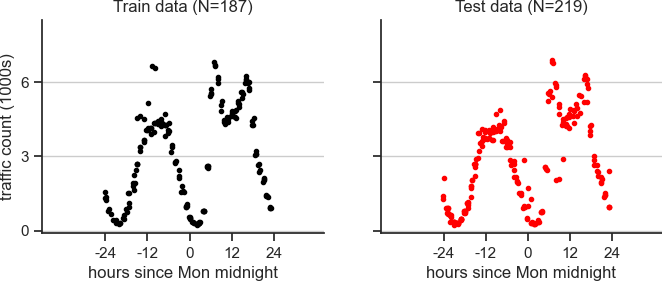

# CP2 - Bayes Linear Regression

Instructions for this assignment are here:

https://www.cs.tufts.edu/cs/136/2025f/cp2.html

# Install

Following the instructions here for the standard "spr_25f_env" used throughout this course:

https://www.cs.tufts.edu/cs/136/2025f/setup_python_env.html

# Data Analysis Task

We're analyzing traffic volume over time at a major highway.

# Outline

Your goal is to build estimators for probabilistic regression. 

Each estimator will implement a `predict` and a `predict_variance` method.

You can see `run_demo_MAP.py` to get a sense of the kinds of predictions this will enable:

* the solid line is the *mean* prediction
* the filled area around the line is the +/- 2 std. dev. interval, where ~95% of the predicted distributions probability mass lies

Your task in Problem 1 is to implement 2 kinds of estimators in python code:

* [ ] Implement MAP - See `LinearRegressionMAPEstimator.py`
* [ ] Implement Posterior predictive - See `LinearRegressionPosteriorPredictiveEstimator.py`
* [ ] Fix TODOs in `run_demo_MAP.py` and `run_demo_PPE.py`
* [ ] Answer questions 1a, 1b, 1c, and 1d in your report

Your task in Problem 2 is to implement 5-fold CV grid search to select hyperparameters

* [ ] Implement `main` in `run_grid_search__5fold_heldout_score.py.`
* [ ] Include figures 2a and 2b in your report

Your task in Problem 3 is to implement evidence-based grid search to select hyperparameters

* [ ] Implement `main` in `run_grid_search__evidence.py`
* [ ] Include figures 3a and 3b in your report
